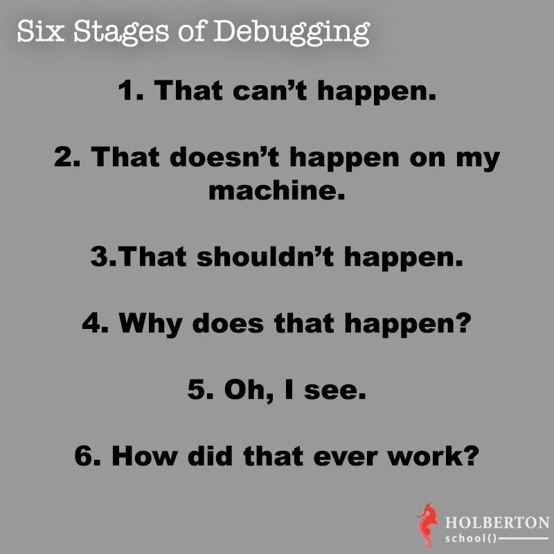

# 0x19. Postmortem

# Background Context

* Any software system will eventually fail, and that failure can come stem from a wide range of possible factors: bugs, traffic spikes, security issues, hardware failures, natural disasters, human error… Failing is normal and failing is actually a great opportunity to learn and improve. Any great Software Engineer must learn from his/her mistakes to make sure that they won’t happen again. Failing is fine, but failing twice because of the same issue is not.

* A postmortem is a tool widely used in the tech industry. After any outage, the team(s) in charge of the system will write a summary that has 2 main goals:

* To provide the rest of the company’s employees easy access to information detailing the cause of the outage. Often outages can have a huge impact on a company, so managers and executives have to understand what happened and how it will impact their work.
* And to ensure that the root cause(s) of the outage has been discovered and that measures are taken to make sure it will be fixed.

Postmortem Report:

# Yearn AI Company (incident #001)
alt text

Date
2021-10-21

# Author: Elisa .H. Dimiti
Status
Complete

Summary
Yearn AI Company's website down for 2 hours 11 minutes.

The event started at 13:04 GMT(East African Time) and ends at 15:15 GMT affecting 100% of the service.

Impact
Estimated 1110 queries lost, no revenue impact.

Root Causes
The load balancer went down due to a combination of exceptionally high load and a fan failure which end up overheating the server.

alt text

Trigger
A sudden increase in traffic when a user promotes the website on Reddit.

Resolution
At the begaining, the load balancer was eliminated from the architecture and it was necessary to set up a pass-through configuration, where the requests were served directly by the web-servers. After that, a new balancer was set up and put in the system.

Detection
The monitor system installed on the servers sent an email.

Timeline
2019-10-21 (all times UTi)

# me	Description
16:51	A Reddit user posts the website a became viral suddenly
16:53	Traffic to Frank video increases by 100x after post
16:54	OUTAGE BEGINS -- the temperature in the load balancer increases so fast and some user cannot access to the website
16:55	most of the users receive pager storm, ManyHttp500s
alt text	
16:57	All traffic to Frank video website is failing
17:01	INCIDENT BEGINS the monitoring system sends an email
17:02	The DevOps Abdel receives the email and starts the analysis and calls the other engineers
17:03	Haroldo, the backend dev is notified
17:04	ping test from different locations shows that the server is isolated
17:06	Abdel calls the service provider but they inform that there is no issue in the datacenter
17:07	Abdel insists that we cannot connect with the load balancer
17:10	The data center informs that apparently the server where the load balancer is located is overheated
17:12	Haroldo starts to change the configuration to avoid the load balancer
17:18	Haroldo runs a puppet manifest that contains the new configuration
17:28	the new configuration has been set up
17:32	the service is partially running. some users cannot connect with the server, but more than 70% of the traffic is ok
17:35	A new server (hardware) is installed in the datacenter
17:45	The new server is set up as a load balacer
18:00	OUTAGE ENDS, all traffic is ok, the new load balancer starts to work
18:30	INCIDENT ENDS, reached exit criterion of 30 minutes' nominal performance
Corrective and preventative measures
Lessons Learned

Single points of failure are the biggest risk
Monitoring quickly alerted us to a high rate (reaching ~100%) of HTTP 500s
Rapidly was set up a temporary configuration
Action Items

Action Item	Type	Owner	Bug
Update playbook with instructions for responding to load balancer failure	mitigate	Abdel	n/a DONE
puppet manifests with different configurations	prevent	Martin	Bug 5554823 TODO
Schedule to test failures	process	docbrown	n/a TODO
detect sigle points of failures	prevent	jennifer	DONE
Add a new load balancer as a backup	prevent	Haroldo	DONE
Supporting Information
Monitoring dashboard
